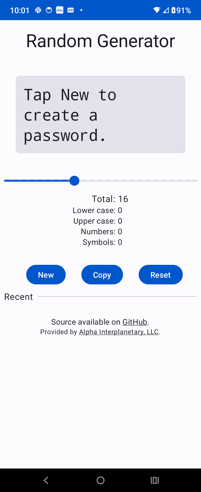
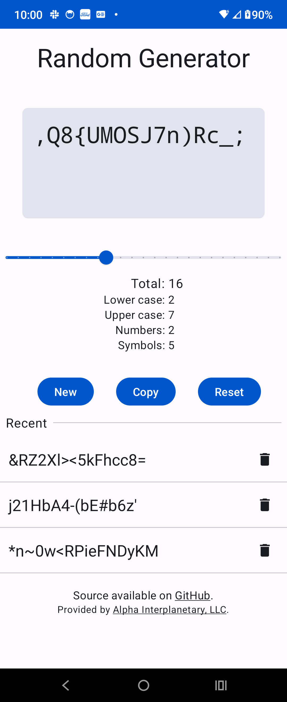

# android-pwdgen
Minimalistic password generator app. Find in the [play store](https://play.google.com/store/apps/details?id=alphainterplanetary.passwordgen).

A simple password creator. No local storage, no network access. Uses the Android keystore to securely save recent entries.

 

# Releases

## 1.1

### New features

- Avoid ambiguous characters in generated passwords

### Other changes

- Landscape mode
- Maintain state across rotations

## 1.0

### New features

- Initial release
